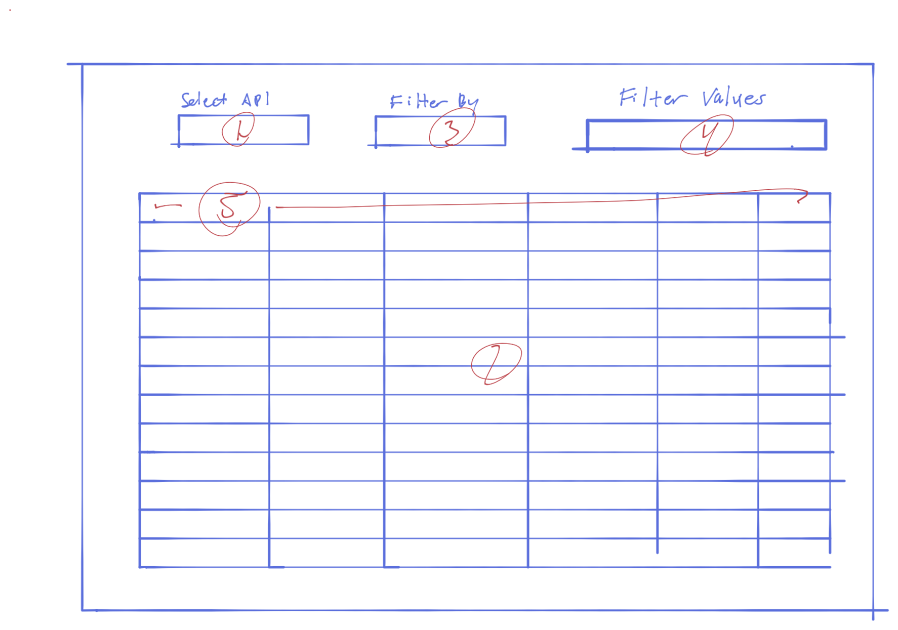

#### Neighborhood Nexus: Assistant Full Stack Developer Orientation
## Exercise 1

### Description
The purpose of this exercise is to demonstrate simple data handling and the ability to use the React Hooks ```useState()``` and ```useEffect()``` to dynamically render a filtered and sortred table.  The final result should be a working single page application which allows the user to select a dataset using a dropdwon, filter the dataset by a given field, render the dataset to a table, and sort the table by clicking on the a given column header.

### Getting Started
1. Clone repo to your a local directory.
2. Create a new branch called "[Your Name]"
 
### Template and Instructions for Development

1. Dropdown for selecting dataset using info in ```./data/APIs.csv```
    * Import CSV directly into application
    * Use package to parse CSV into a format for easily rendering dropdown options
      * The ```csv``` method provided in ```d3``` npm package is easy option but feel free to another package if you choose.
    * Import and use ```<Dropdown selection/>``` component from ```semantic-ui-react``` npm package
    * Make API call using selected option 
2. Table of returned data (rendered condition to whether data is returned)
    * Build from scratch or use package
    * Each row should be a record in the ```features``` array in the returned JSON
    * Each column should be a field in the ```fields``` array in the returned JSON
    * The body of the table should be scrollable within its container.
    * The header should be fixed.  To save you time, here is the CSS for a sticky header row...
  ```
  .header-row {
    position: sticky !important;
    top: 0;
    z-index: 2;
  }
  ```
3. Dropdown for choosing a field by which to filter table (rendered conditional to wheter data is returned)
    * Import and use ```<Dropdown selection/>``` component from ```semantic-ui-react``` npm package.
    * The options in this dropdown should simply be a list of the fields represented in the data, found in the ```fields``` array of the returned JSON.
4. Dropdown or Input fields to set the value(s) for filtering the data (rendered conditional to whether a "Filter By" option has been chosen)
    * If the data type of the "Filter By" field is a string, import and use ```<Dropdown multiple/>``` component from ```semantic-ui-react``` npm package.
      * The options should a <u>deduplicated</u> list of all the  values for the selected "Filter By" field.
    * If the data type of the "Filter By" field is an integer, import and use ```<Input/>``` component from ```semantic-ui-react``` npm package to set <u>both</u> a <b>minimum</b> and <b>maximum</b> value.
      * The initial values should be the min and max values of the field for the entire dataset.
    * Changing these values should dynamically filter the table
5. Header cells by the associated column when clicked
    * The first click should sort the rows from lowest-to-highest
    * The second click should sort the rows from highest-to-lowest
    * The third click should return the rows to the default order